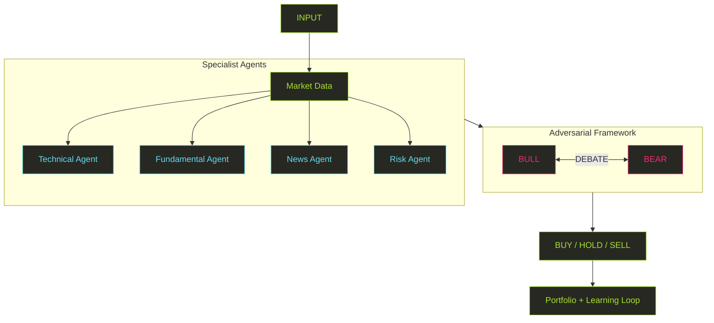
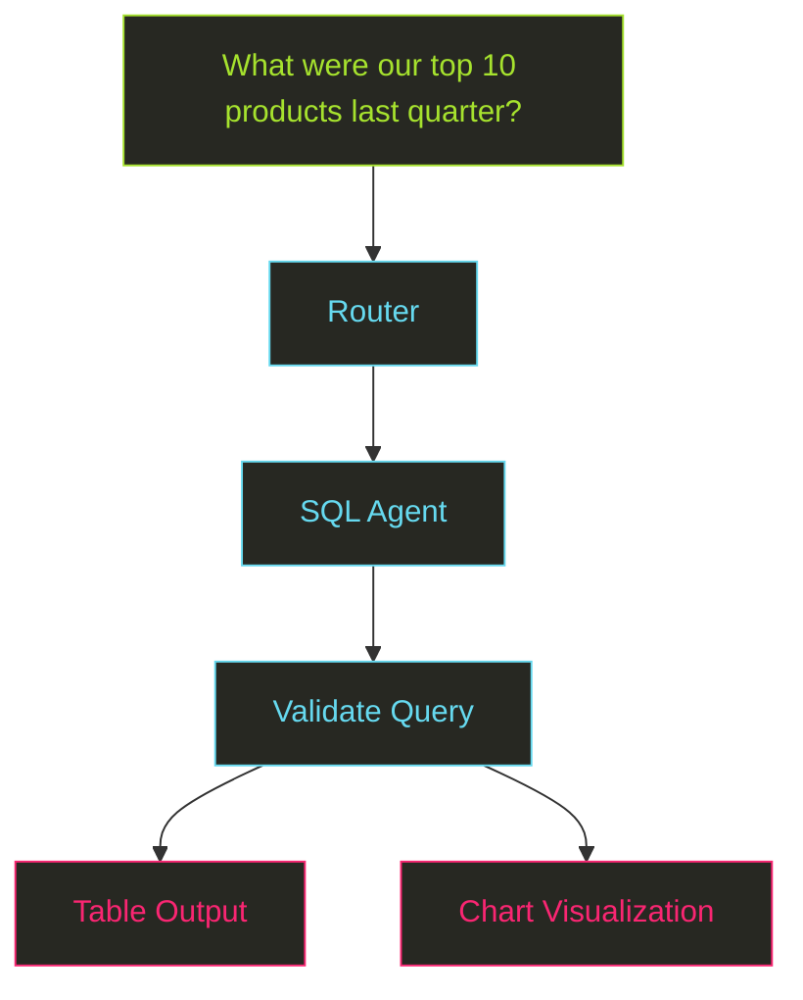
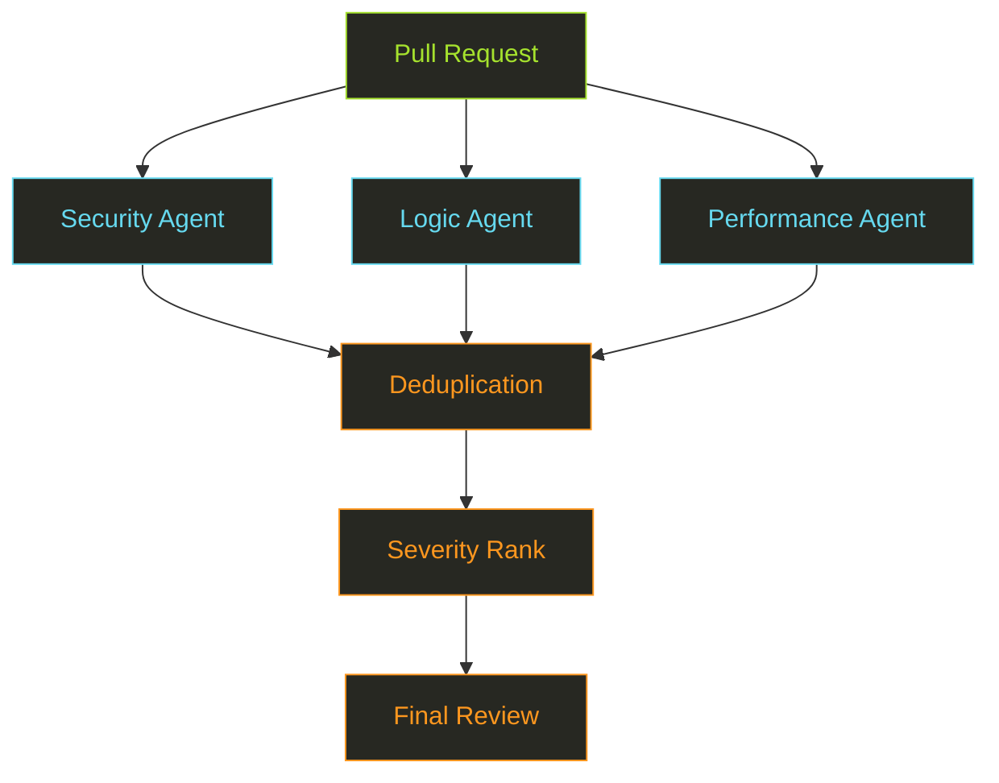
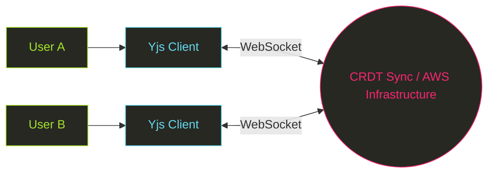

<!-- ═══════════════════════════════════════════════════════════════════════ -->
<!--                       SUMIT GOYAL // README.md                        -->
<!-- ═══════════════════════════════════════════════════════════════════════ -->

<p align="center">
  <!-- Line 1: Name typed once -->
  
  <br/>
  <!-- Line 2: Terminal Boot sequence loop -->
  
</p>

<p align="center">
  <a href="https://github.com/sumit-0804">
    
  </a>
  <a href="https://linkedin.com/in/sumit--goyal">
    
  </a>
  <a href="mailto:sumitg2004@gmail.com">
    
  </a>
  <a href="https://github.com/sumit-0804?tab=repositories">
    
  </a>
</p>

<br/>

```json
{
  "identity": {
    "name": "Sumit Goyal",
    "role": "Software Developer",
    "specialization": [
      "AI Agents",
      "Full-Stack Systems",
      "Real-Time Applications"
    ],
    "status": "building"
  },
  "mission": "Turn complex ideas into systems that actually work.",
  "currently": {
    "learning": [
      "Advanced Agentic Architectures",
      "Distributed Systems",
      "ML Engineering"
    ],
    "building": [
      "Multi-Agent Systems",
      "Developer Tools",
      "Data Intelligence Products"
    ]
  }
}
```

---

## `GET /about`

> **I build systems, not just interfaces.**

My work sits at the intersection of **AI agents, backend engineering, and full-stack product development**.

I enjoy taking an idea from:

`problem → architecture → agents → APIs → interface → deployment`

and turning it into something people can actually use.

<table>
<tr>
<td width="33%" valign="top">

### `01 // AGENTS`

Multi-agent systems built with **LangGraph**, including routing, parallel execution, debate, tool use, and self-correction.

</td>
<td width="33%" valign="top">

### `02 // SYSTEMS`

Backend systems with **FastAPI, Node.js, PostgreSQL, MongoDB, WebSockets, and streaming APIs**.

</td>
<td width="33%" valign="top">

### `03 // PRODUCTS`

Full-stack products using **Next.js, React, and TypeScript**, with a focus on real-time experiences and clean UX.

</td>
</tr>
</table>

---

## `GET /projects`

### `01` — AlphaForge AI

<a href="https://github.com/sumit-0804/AlphaForge-AI">
  <h3><b>Autonomous Investment Research & Paper Trading</b></h3>
</a>



**Key Features & Highlights:**
* **Parallel Specialist Agents:** Multi-disciplinary signal extraction across technicals, fundamentals, and news.
* **Adversarial Debate:** Bull vs Bear reasoning framework to evaluate trade resilience before execution.
* **Real-time & Adaptive:** Live streaming execution analysis integrated with vector-search trade memory.
* **Multi-Currency Engine:** Full paper trading simulation supporting global asset allocations.

<p align="left">
  
  
  
  
  
  
</p>

---

### `02` — OmniQuery

<a href="https://github.com/sumit-0804/omniquery">
  <h3><b>Natural Language → Data Intelligence</b></h3>
</a>



Ask questions about **Postgres, CSV, Parquet, and JSON** without writing SQL.

* **Text-to-SQL Generation:** Dynamic query assembly across multiple document types.
* **Safety Sandbox:** Query validation layer featuring strict read-only execution constraints.
* **Self-Correction Engine:** Automated retry loops for database-level visual and syntax fixes.
* **Real-time Pipeline:** Live agent state streaming directly to client interfaces.

<p align="left">
  
  
  
  
</p>

---

### `03` — Code-Sentinel

<a href="https://github.com/sumit-0804/Code-Sentinel">
  <h3><b>Multi-Agent Code Review</b></h3>
</a>



Five specialist agents independently review a pull request and merge findings into a unified actionable report.

<p align="left">
  
  
  
  
</p>

---

### `04` — Scribly

<a href="https://github.com/sumit-0804/Scribly">
  <h3><b>Real-Time Collaborative Editor</b></h3>
</a>



Built around **Yjs CRDTs** for conflict-free collaboration with live presence tracking, version history, offline editing, role-based sharing, and cloud scalability powered by AWS.

<p align="left">
  
  
  
  
  
</p>

---

### `05` — Campus Vault

<a href="https://github.com/sumit-0804/campus-vault">
  <h3><b>University Marketplace + Lost & Found</b></h3>
</a>

A campus-focused platform combining marketplace functionality, real-time messaging, and AI-powered content protection.

* **Real-Time Communication:** Instant messaging via Pusher with offer negotiation logic.
* **Safety First:** Automated PII detection and trust/karma calculation on user interactions.
* **AI Visual Search:** Multi-modal image tagging for precise inventory and lost item indexing.

<p align="left">
  
  
  
  
</p>

---

## `GET /stack`

### `01 // LANGUAGES`
<p align="left">
  
  
  
</p>

### `02 // FRONTEND`
<p align="left">
  
  
  
  
</p>

### `03 // BACKEND`
<p align="left">
  
  
  
  
</p>

### `04 // DATA & STORAGE`
<p align="left">
  
  
  
  
</p>

### `05 // AI & LLM ARCHITECTURES`
<p align="left">
  
  
  
</p>

### `06 // REAL-TIME & COLLABORATION`
<p align="left">
  
  
  
</p>

### `07 // INFRASTRUCTURE & DEVOPS`
<p align="left">
  
  
  
  
  
</p>

---

## `GET /github`

<p align="center">
  
  
  
</p>

---

## `GET /connect`

```json
{
  "open_to": [
    "Software Engineering Internships",
    "AI Engineering Roles",
    "Open Source",
    "Interesting Collaborations"
  ],
  "contact": {
    "github": "sumit-0804",
    "email": "sumitg2004@gmail.com",
    "linkedin": "https://www.linkedin.com/in/sumit--goyal/"
  },
  "availability": true
}
```

<br/>

<p align="center">
  
</p>

<p align="center">
  <sub>Built with curiosity. Shipped with code.</sub>
</p>